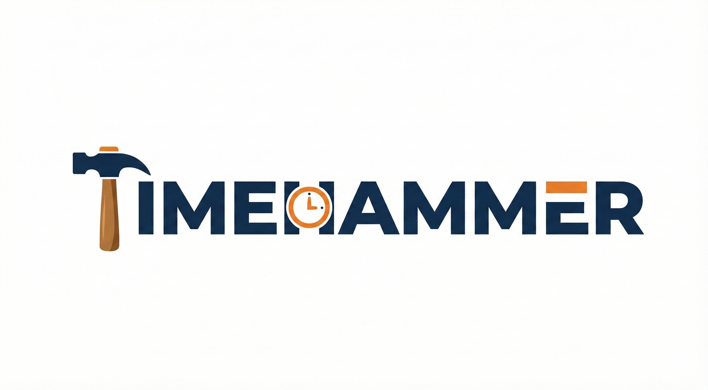

<p align="center">
  
</p>

# TimeHammer 🔨⏰

A standalone, cross-platform NTP security testing tool for IoT, IIoT, and embedded device testing.


## ⚠️ Disclaimer

**This tool is for SECURITY TESTING purposes only.** 

- ❌ DO NOT use on production systems
- ❌ DO NOT use without authorization
- ❌ DO NOT use on networks you don't own/control
- ✅ Use in isolated test environments only
- ✅ Get proper authorization before testing
- ✅ Document all testing activities

The authors are not responsible for misuse of this tool.

## 🌟 Features

### Core Features
- **Cross-platform**: Single binary for Windows, Linux, and macOS
- **TUI Interface**: Beautiful terminal UI with tview + tcell
- **Standalone**: Creates its own data directory (`./.timehammer/`)
- **NTP/SNTP Support**: Full RFC 5905 (NTPv4) and SNTP support
- **Configurable Ports**: Standard port 123, custom ports, or auto-fallback
- **Multiple Interfaces**: Bind to specific network interfaces
- **Upstream Sync**: Sync with public NTP servers (time.google.com, etc.)
- **Multi-client**: Support for 50-100+ concurrent clients
- **Timezone Support**: Configure server to respond with local time offsets (e.g., "America/New_York")

### Security Testing Mode 🔓
- **Time Spoofing** - Send fake time to clients (future/past)
- **Gradual Time Drift** - Slowly drift time to evade detection
- **Kiss-of-Death (KoD)** - CVE-2015-7704/7705 attack simulation
- **Stratum Manipulation** - Claim higher authority (stratum 1)
- **Leap Second Injection** - Test leap second handling bugs
- **Timestamp Rollover** - Y2K38 and NTP Era 1 testing
- **Clock Step Attack** - Sudden large time jumps
- **Client Fuzzing** - Randomly mutate NTP fields to test robustness

### Logging & Export
- Real-time log viewer in TUI
- Client fingerprinting (implementation detection)
- JSON/CSV log export
- Session recording and replay

## 📦 Installation

### From Source

```bash
# Clone the repository
git clone https://github.com/neutrinoguy/timehammer.git
cd timehammer

# Build
go build -o timehammer ./cmd/timehammer

# Run
./timehammer
```

### Cross-Platform Build

```bash
# Linux (amd64)
GOOS=linux GOARCH=amd64 go build -o timehammer-linux-amd64 ./cmd/timehammer

# Windows (amd64)
GOOS=windows GOARCH=amd64 go build -o timehammer-windows-amd64.exe ./cmd/timehammer

# macOS (amd64)
GOOS=darwin GOARCH=amd64 go build -o timehammer-darwin-amd64 ./cmd/timehammer

# macOS (arm64 - Apple Silicon)
GOOS=darwin GOARCH=arm64 go build -o timehammer-darwin-arm64 ./cmd/timehammer
```

## 🚀 Usage

### TUI Mode (Default)

```bash
./timehammer
```

### Headless Mode

```bash
./timehammer --headless
```

### Keyboard Shortcuts

| Key | Action |
|-----|--------|
| `F1` | Dashboard |
| `F2` | View Logs |
| `F3` | Edit Configuration |
| `F4` | Attack Mode / Security Testing |
| `F5` | Session Management |
| `F10` | Start/Stop Server |
| `F12` / `Esc` | Quit |
| `Ctrl+S` | Save Configuration |
| `Ctrl+E` | Export Logs (JSON & CSV) |
| `Ctrl+R` | Toggle Session Recording |
| `Ctrl+U` | Force Upstream Sync |
| `?` | Show Help |

## ⚙️ Configuration

Configuration is stored in `./.timehammer/config.yaml`:

```yaml
server:
  interface: ""           # Empty = all interfaces
  port: 123              # Standard NTP port
  alt_port: 1123         # Fallback if 123 is busy
  max_clients: 100
  ntp_version: 4
  stratum: 2
  timezone: "UTC"        # IANA Timezone (e.g. America/New_York)

upstream:
  servers:
    - address: time.google.com
      port: 123
      priority: 1
      enabled: true
    - address: time.cloudflare.com
      port: 123
      priority: 2
      enabled: true
  sync_interval: 60
  timeout: 5

security:
  enabled: false
  active_attack: ""
  time_spoofing:
    offset_secs: 3600    # 1 hour into future
  kiss_of_death:
    code: "DENY"
  rollover:
    target_year: 2038
    mode: "y2k38"
```

## 🔓 Security Attacks

### Time Spoofing
Send clients a controlled fake time. Useful for testing:
- Certificate expiration handling
- Token/session expiry
- Scheduled task behavior

### Gradual Time Drift
Slowly drift time forward or backward to evade detection. Tests:
- Drift detection mechanisms
- Long-term time tolerance

### Kiss-of-Death (KoD)
Send KoD packets to disable client synchronization. Based on:
- CVE-2015-7704
- CVE-2015-7705

### Stratum Manipulation  
Claim to be a stratum 1 (GPS-synced) server. Tests:
- Server selection algorithms
- Stratum preference bugs

### Leap Second Injection
Inject leap second flags. Tests:
- Leap second handling bugs
- System stability during leap events

### Timestamp Rollover
Send timestamps near rollover boundaries:
- **Y2K38**: Unix 32-bit timestamp overflow (Jan 19, 2038)
- **NTP Era 1**: NTP timestamp rollover (Feb 7, 2036)

### Clock Step Attack
Sudden large time jumps. Tests:
- Step vs slew behavior
- Application resilience

### Client Fuzzing
Randomly mutates NTP protocol fields to test client stability and error handling:
- **Header Fuzzing**: Invalid versions, modes, stratums
- **Timestamp Fuzzing**: Zero, max, mismatching timestamps
- **Logic Fuzzing**: Invalid poll intervals, precision, root delay

## 📁 File Structure

```
./.timehammer/
├── config.yaml          # Configuration file
├── timehammer.log       # Log file
├── sessions/            # Session recordings
│   └── session_*.json
└── exports/             # Exported logs
    ├── logs_*.json
    └── logs_*.csv
```

## 🔧 Troubleshooting

### Port 123 Already in Use

On **macOS**:
```bash
sudo lsof -i :123
sudo launchctl unload /System/Library/LaunchDaemons/org.ntp.ntpd.plist
```

On **Linux**:
```bash
sudo ss -tulpn | grep :123
sudo systemctl stop systemd-timesyncd
# or
sudo systemctl stop ntp
```

On **Windows** (as Administrator):
```cmd
netstat -ano | findstr :123
net stop w32time
```

## 🤝 Contributing

Contributions are welcome! Please read our contributing guidelines and submit pull requests.

## 📄 License

This project is licensed under the MIT License - see the [LICENSE](LICENSE) file for details.

## 🙏 Acknowledgments

- [beevik/ntp](https://github.com/beevik/ntp) - NTP client library
- [rivo/tview](https://github.com/rivo/tview) - TUI framework
- [gdamore/tcell](https://github.com/gdamore/tcell) - Terminal library

## ⚡ Related Projects

- [Chrony](https://chrony.tuxfamily.org/) - Versatile NTP implementation
- [ntpd](https://www.ntp.org/) - Reference NTP implementation
- [Roughtime](https://roughtime.googlesource.com/roughtime) - Secure time protocol

---

## 🤖 AI Credits

Built with ❤️ using `Claude Opus 4.5` and Google Antigravity 🤖
